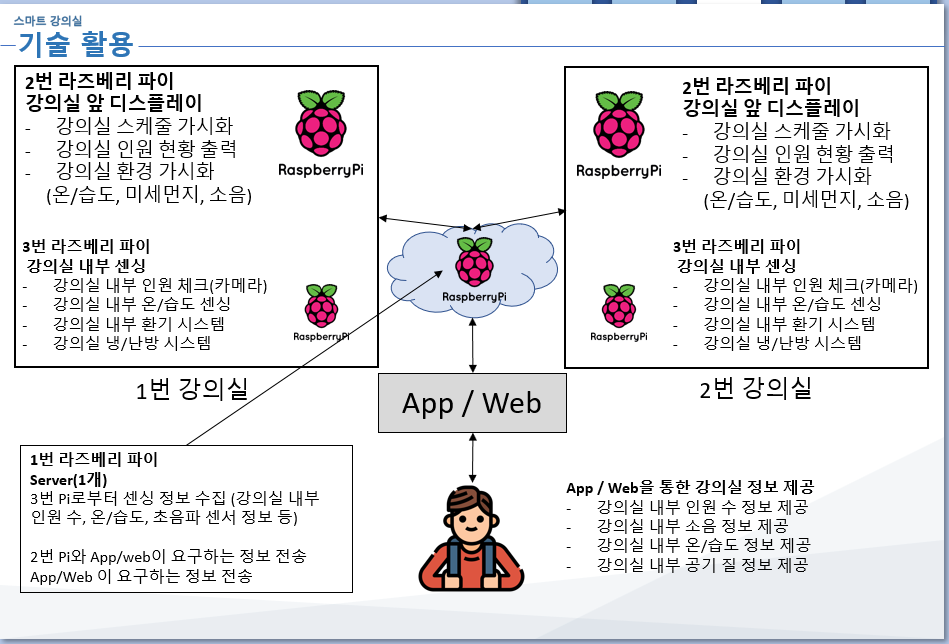

# classroomIoT Mobius Cam-core

Rasp Face detection maybe..

## Concept

Mobius thyme ncore



1. Check how much people in classroom (OpenCV)
2. Check temperature & motor control (GPIO - UART)

# Install OpenCV

## Windows 10 - WSL

```bash
npm i -S opencv-build
```

## Raspberry Pi 3

1. Install [OpenCV 4.2.0 precompiled by dltpdn](https://github.com/dltpdn/opencv-for-rpi/releases/tag/4.2.0_buster_pi3b)

```bash
sudo apt-get update && sudo apt-get upgrade -y
sudo apt-get install -y \
	libjpeg-dev libpng-dev libtiff-dev libgtk-3-dev \
	libavcodec-extra libavformat-dev libswscale-dev libv4l-dev \
	libxvidcore-dev libx264-dev libjasper1 libjasper-dev \
	libatlas-base-dev gfortran libeigen3-dev libtbb-dev

mkdir opencv42
cd opencv42
wget https://github.com/dltpdn/opencv-for-rpi/releases/download/4.2.0_buster_pi3b/opencv4.2.0.deb.tar
tar -xvf opencv4.2.0.deb.tar
sudo apt install -y ./OpenCV*.deb
```

2. Copy library to local

```bash
sudo mkdir /usr/local/lib/opencv4.2
cp -Lr /usr/lib/libopencv*.so /usr/local/lib/opencv4.2/
```

3. Set environment

```bash
export OPENCV4NODEJS_DISABLE_AUTOBUILD=1
export OPENCV_LIB_DIR=/usr/local/lib/opencv4.2/
export OPENCV_INCLUDE_DIR=/usr/include/opencv4
```

4. try to build and fail

```bash
npm i -S opencv4nodejs
```

5. manual build

```bash
npm i -g node-gyp
cd node_modules/opencv4nodejs/
node-gyp rebuild
```

6. Finish!
